# Searching

The process of selecting particular information from a collection of data based on specific criteria.

Can be performed on different data structures.
- `sequence search` – search within a sequence.
- `search key` (or key) – identifies a specific item.
- `compound key` – consists of multiple parts.

## Linear Search

Iterates over the sequence, item by item, until the specific item is found or the list is exhausted.
- The simplest solution to sequence search problem.
- Python's `in` operator: find a specific item.

```python
if key in theArray :
  print( 'The key is in the array.' )
else :
  print( 'The key is not in the array.' )
```

Searching for `31`:

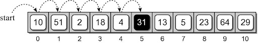

Searching for `8`:

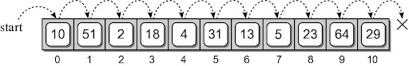

```python
def linear_search( the_values, target ) :
  n = len( the_values )
  for i in range( n ) :
    if the_values[i] == target
      return True  # or return I
  return False # or return -1
```

### Linear Search: Sorted Sequence

A linear search can be performed on a sorted sequence.
Example: searching for `8`.

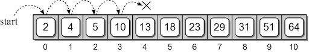

Similar to the unsorted sequence, with one major difference:

```python
def sorted_linear_search( the_values, target ) :
  n = len( the_values )
  for i in range( n ) :
    if the_values[i] == target :
      return True
    elif the_values[i] > target :
      return False
  return False
```

### Linear Search: Smallest Value

We can search for an item based on certain criteria.
Example: find the smallest value.

```python
def find_smallest( the_values ):
  n = len( the_values )
  smallest = the_values[0]
  for i in range( 1, n ) :
    if the_values[i] < smallest :
      smallest = the_values[i]

  return smallest
```

## Binary Search

The linear search has a linear time-complexity.
- We can improve the search time if we modify the search technique itself.
- Use a **divide and conquer** strategy.
- Requires a sorted sequence.

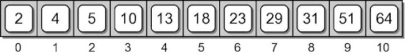

If we search for `10` in the list,
- First, examine the middle item:
- One of three possible conditions:
  - target is found in the middle item.
  - target is less than the middle item.
  - target is greater than the middle item.

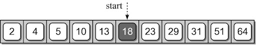

Since the sequence is sorted, we can eliminate half the values from further consideration, because value `10` can’t be in that second half.

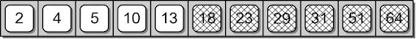

Repeat the process until
- either the target is found (as below)
- or all items have been eliminated (e.g., search for 6.)

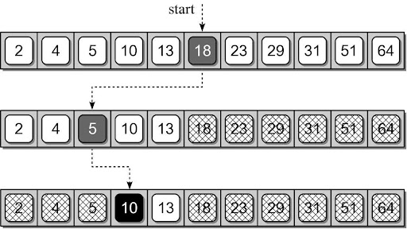

### Implemenation

```python
def binary_search( the_values, target ) :
  low = 0
  high = len(the_values) - 1

  while low <= high :
    mid = low + (high - low) // 2
    if the_values[mid] == target :
      return True  # or return mid
    elif target < the_values[mid] :
      high = mid - 1
    else :
      low = mid + 1

  return False  # or return -1
```

### Example

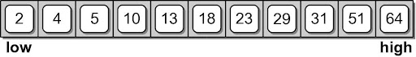

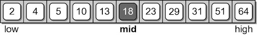

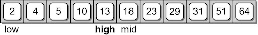

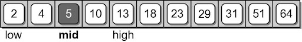

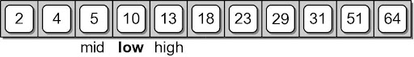

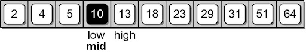

## Comparison

Run `test_search.py`

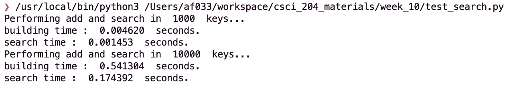
Linear Search time: `0.174 sec` for 10,000 keys.

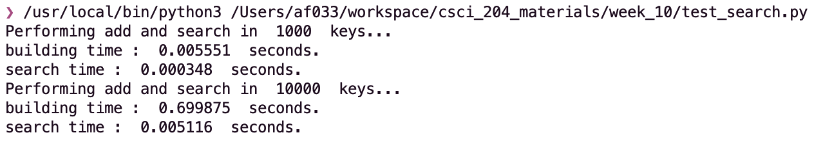
Binary Search time: `0.005 sec` for 10,000 keys.

**Conclusion:** Binary Search is about **35x** times faster than linear search in this experiment.

## Activity

Implement Binary Search in Recursion
