# Selection Sort

- Improves on `Bubble Sort`.
- Works in a fashion similar to what a human may use to sort a sequence.
- Instead of swapping many items,
  - repeatedly selects the next largest (or the smallest) item from among the unsorted items, puts it in the right place.
  - requires a search to select the smallest item in each round.

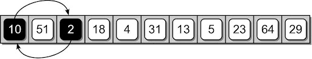
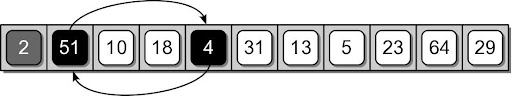

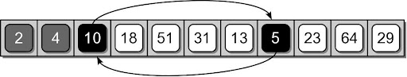
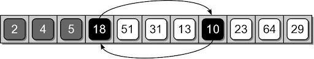
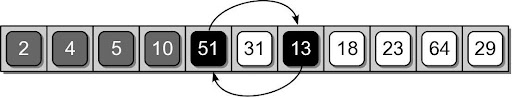
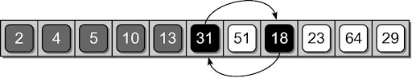
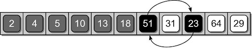
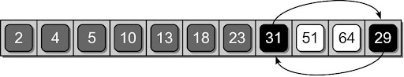
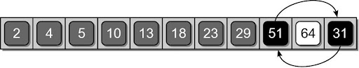
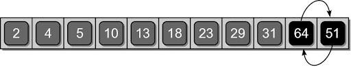


### Activity: Implementation

Find the `selection_sort(sequence)` function in `sorting.py` and implement it. Run `test_sorting.py` for the completed unittest.
```python
def selection_sort( the_seq ):
  # TODO: Activity 1
  pass
```

## Insertion Sort
- Another commonly studied algorithm.
- Arranges the items by
  - iterating over the sequence one complete time.
  - inserts each unsorted item into its proper place.


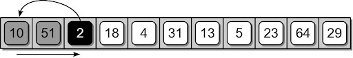
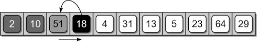
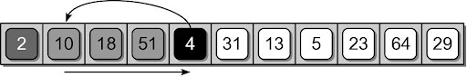
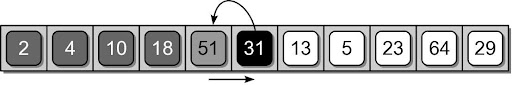
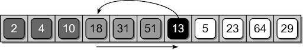
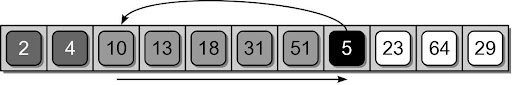
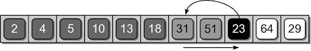

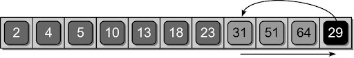


### Activity: Implementation

Find the `insertion_sort(sequence)` function in `sorting.py` and implement it. Run `test_sorting.py` for the completed unittest.
```python
def insertion_sort( the_seq ):
  # TODO: Activity 2
  pass
```
