# Merge and Quick Sort

### Sorting Algorithms
Can be divided into two categories:

- `comparison sorts` items are arranged by performing pairwise logical comparisons between two sort keys.
- `distribution sorts` distributes the sort keys into intermediate groups  based on individual key values.

## Merge Sort
Uses a divide and conquer strategy to sort the keys stored in a sequence.
- Keys are recursively divided into smaller and smaller subsequences until 1 element.
- These individual elements are in order by themselves
- Subsequences are merged back together.

### Merge Sort – Divide

Starts by splitting the original sequence in the middle to create two subsequences of  approximately equal size.

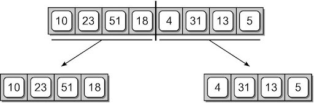

The two subsequences are then split in the middle.

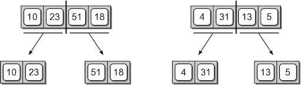

The subdivision continues until there is a single item in the sequence.

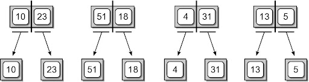

### Merge Sort – Conquer

After the sequences are split, they are merge back together, two at a time to create sorted sequences.

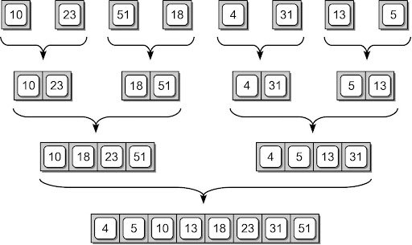

### Implementation: Basic Version

```python
def pythonMergeSort( theList ):
   # Check the base case.
  if len(theList) <= 1 :
    return theList
  else :
    # Compute the midpoint.
    mid = len(theList) // 2

    # Split the list and perform the recursive step.
    leftHalf = pythonMergeSort( theList[ :mid ] )
    rightHalf = pythonMergeSort( theList[ mid: ] )

    # Merge the two ordered sublists.
    newList = merge(leftHalf, rightHalf)
    return newList
```

```python
def merge( left, right ):
    """
    Merge to sorted list, left and right, into one sorted list.
    """
    aList = []
    lt = 0
    rt = 0

    # Repeatedly move the smallest of left and right to the new list
    while lt < len( left ) and rt < len( right ):
        if left[ lt ] < right[ rt ]:
            aList.append( left[ lt ]  )
            lt += 1
        else:
            aList.append( right[ rt ] )
            rt += 1

    # There will only be elements left in one of the original two lists.

    # Append the remains of left (lt..end) on to the new list.
    while lt < len(left):
        aList.append( left[ lt ] )
        lt += 1

    # Append the remains of right (rt..end) on to the new list.
    while rt < len( right ):
        aList.append( right[ rt ] )
        rt += 1

    return aList
```

### Implementation: Improved Version
The previous version:
- only works with Python lists.
- the splitting creates new physical lists.
- uses the slice operation which is time consuming.

We can improve the implementation:
- using virtual subsequences.
- that works with any sequence.

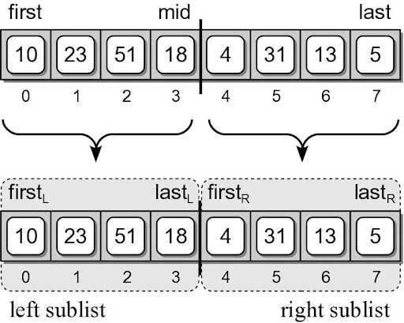

```python
def recMergeSort( theSeq, first, last, tmpArray ):
   # Check the base case.
  if first == last :
    return
  else :
     # Compute the mid point.
    mid = (first + last) // 2

     # Split the sequence and perform the recursive step.
    recMergeSort( theSeq, first, mid, tmpArray )
    recMergeSort( theSeq, mid+1, last, tmpArray )

    # Merge the two ordered subsequences.
    mergeSeq( theSeq, first, mid+1, last, tmpArray )

def mergeSeq( theSeq, left, right, end, tmpArray ):
  a = left
  b = right
  m = 0

  while a < right and b <= end :
    if theSeq[a] < theSeq[b] :
      tmpArray[m] = theSeq[a]
      a += 1
    else :
      tmpArray[m] = theSeq[b]
      b += 1
    m += 1

  while a < right :  # in parallel with first while
    tmpArray[m] = theSeq[a]
    a += 1
    m += 1

  while b <= end :    # in parallel with the two whiles
    tmpArray[m] = theSeq[b]
    b += 1
    m += 1

  for i in range( end – left + 1 ) :
    theSeq[i+left] = tmpArray[i]
```

#### Merge Sort – Temporary Array
A temporary array is used to merge two virtual subsequences.

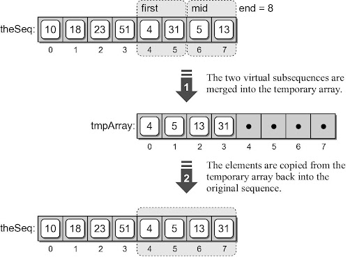

#### Wrapper Function

A function that provides a simpler and cleaner interface for another function.
- Provides little or no additional functionality.
- Commonly used with recursive functions that require additional arguments.

```python
def mergeSort( theSeq ):
  n = len( theSeq )
  tmpArray = Array( n )
  recMergeSort( theSeq, 0, n-1, tmpArray )
```

### Efficiency
We need to determine the number of invocations and the time required by each function.

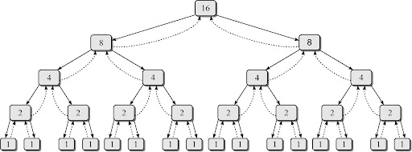

Consider a sequence of `n` items.

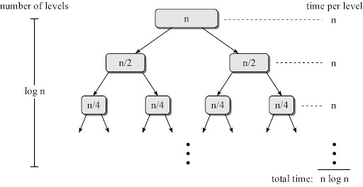

So the total time needed for merge sort is `O(n log n)`.

## Quicksort

Uses a divide and conquer strategy to sort the keys stored in a sequence.
- Pick a pivot in the sequence
- Partition the sequence by dividing it into two segments based on a pivot key.
- Uses subsequences without the need for temporary storage.

Quick sort is a recursive algorithm.

### Description
1. Select the first key as the pivot, `p`
2. Partition the sequence into segments `L` and `G`.
    - L contains all keys less than p
    - G contains all keys greater than or equal to p.
3. Recursively apply the same operation on `L` & `G`.
    - Continues until the sequence contains `0` or `1` key.
4. Merge the pivot and two segments back together.

### Quicksort - Divide

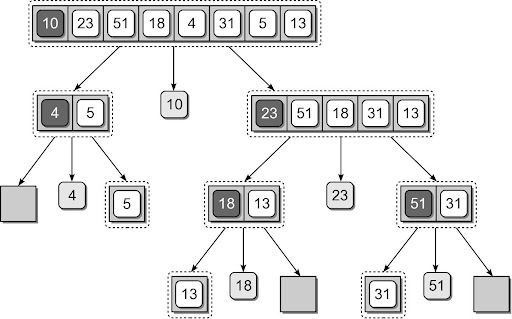
1. Pick the first item, `10`, as the pivot
2. Split the array into 2, based on pivot
3. Repeat...

### Quicksort - Merge
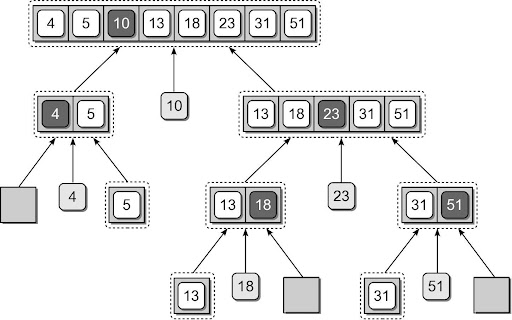

Merge sorted portions in reverse order

### Implementation

An efficient solution can be designed:
```python
def quickSort( theSeq ):
  n = len( theSeq )
  recQuickSort( theSeq, 0, n-1 )

def recQuickSort( theSeq, first, last ):

  if first >= last :
    return
  else :
    # Partition the sequence and obtain the pivot position.
    pos = partitionSeq( theSeq, first, last )

    # Repeat the process on the two subsequences.
    recQuickSort( theSeq, first, pos - 1 )
    recQuickSort( theSeq, pos + 1, last )
```

### Quicksort - Partition
The partitioning step can be done without having to use temporary storage.
- Rearranges the keys within the sequence structure.

  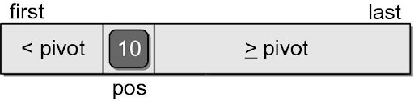

- The pivot will be in its correct position within the sequence.
- Position of the pivot indicates the position where the split occurred.
- For illustration, we step through the first complete partitioning.
    - Pivot value is the first key in the segment.
    - Two markers (`left` and `right`) are initialized.

      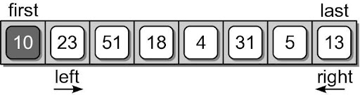
    - The markers will be shifted left and right until they cross each other.

    - The `left` marker is shifted right until a key value larger than the pivot is found.

      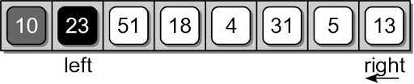
    - The right marker is then shifted left until a key value less than the pivot is found.

      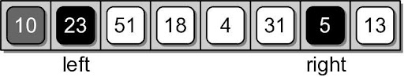

    - The two keys at the positions of the left and right markers are swapped.

      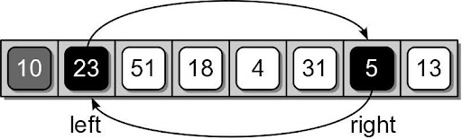
      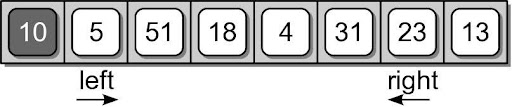

    - The two markers are again shifted starting where they left off.

      
      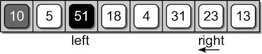
      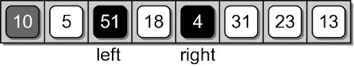

    - After the markers are shifted, the corresponding keys are swapped as before.

      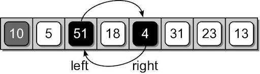
      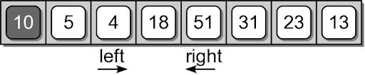

    - The shifting and swapping continues until the two markers cross each other.

      
      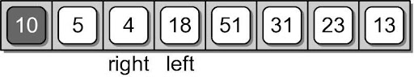

    - When the two markers cross, the right marker indicates the final position of the pivot value.
      - The pivot value and the value at the right marker have to be swapped.

      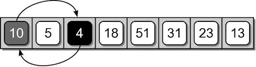
      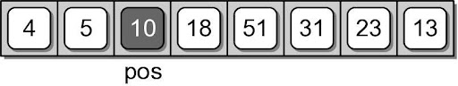

### Quicksort - Implementation: Partition

```python
def partitionSeq( theSeq, first, last ):
  pivot = theSeq[first]
  left = first + 1
  right = last
  while left <= right :
    while left < right and theSeq[left] < pivot :
      left += 1

    while right >= left and theSeq[right] >= pivot :
      right -= 1

    if left < right :   # swap the items at left and right
      tmp = theSeq[left]
      theSeq[left] =  theSeq[right]
      theSeq[right] = tmp

  if right != first :   # put the pivot in its final place
    theSeq[first] = theSeq[right]
    theSeq[right] = pivot

  return right
```

### Pivot Key

We are not limited to selecting the first key within the sequence as the pivot.
- Using the first or last key is a poor choice in practice.
- Choosing a key near the middle is a better choice. (you will expore this in lab tomorrow)


### Quicksort Efficiency

The quick sort algorithm:
- has a worst case time of `O(n^2)`
- but an average case time of `O(n log n)`
- It does not require additional storage (in-place).

Commonly used in language libraries.
- Earlier versions of Python used quick sort.
- Current versions use a hybrid that combines the insertion and merge sort algorithms.


