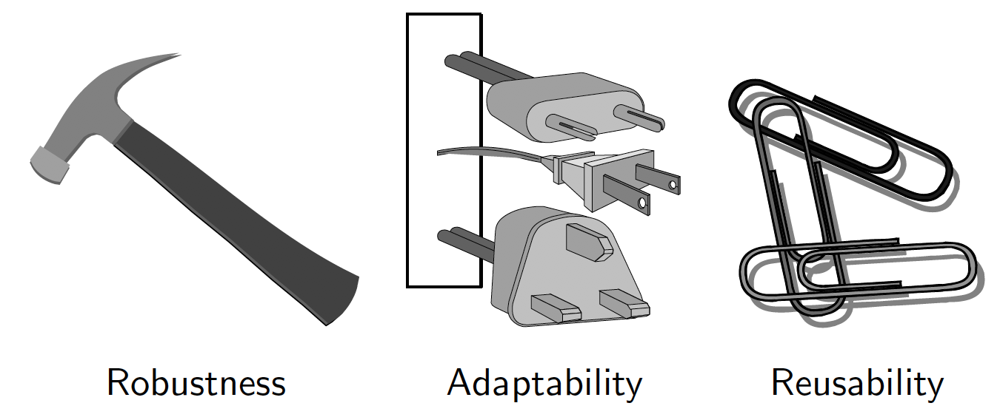
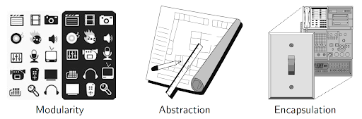
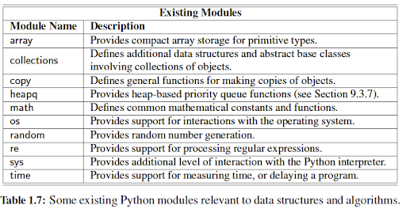

# Lecture 2.1
## File I/O, Exceptions, OOP

## OOP - Object Oriented Design

OOP: Design Goals


OOP: Design Principles


### Modules
Do we write thousands of lines of code into one file?
(NO!.....At least very rarely)

We use modules to organize programs.

A python module is a python file that can be imported in another python file.
```python
import math                 # alias the math module. to call a function: math.sqrt(5)
from math import sqrt, sum  # import specific functions/classes. to call: sqrt(5)
from math import *          # import everything (not recommended). to call: sqrt(5)
```

A file can be imported from a subfolder. This only works if the subfolder has an empty `__init__.py` inside:
```python
from subfolder.test import hello
hello()
```

You can also import renaming the module in the process. This is useful if you have two modules with the same name which would normally conflict:
```python
import math
import helpers.math as math2

# math.sqrt()
# math2.power(1, 2)
```


You can see this example in the files.

A major reason why Python is so popular is its large set of available modules allowing you to quickly perform specific tasks without reinventing the wheel. Here are some examples:


