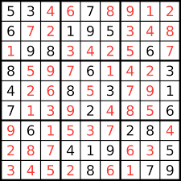
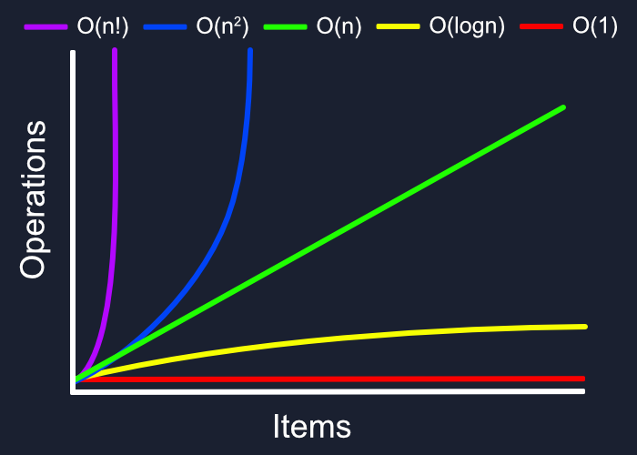

# Lecture 2.3

## Algorithm Analysis

What is a good algorithm? Can we measure it?
- Does what it claims to do _Yes, we often can_
- Low time complexity _Yes, we can_
- Low space complexity _Yes, we can_

#### Example: Sudoku Solver
We know there is an exact solution thus we only need to ask two questions:
- How fast does it run?
- How much space (memory) does it use?



### Example 2
Pretend we had a list with `x` different names.
We build the following method to see if a name is in our list:

```python
def is_name_in_list(my_list, search_name):
	for item in my_list:
		if item == search_name:
			return True
	return False
```
How do we measure the "speed" of a program?
What do we need to know to determine how fast this will run?

#### Why does this matter?
Computers are so fast! But…
[High Performance Environments](https://www.youtube.com/watch?v=3Km1K-DVNNk) - milliseconds matter!
Limited Resources (phones, watches, wearable computing)

#### Measure the work instead of timing
- If we actually measure time, e.g., using the Linux time command, we can’t account for the speed differences among different computers.
- Rather, we’d measure the steps an algorithm or a program will take when comparing them.
- Try a few examples with the time command
```bash
$ time <command> <args>
```

## Big-O Notation
- No need to count precise number of steps
- Classify algorithms by order of magnitude
  - Execution time
  - Space requirements
- Big O gives us a rough upper bound
- Goal is to give you intuition

#### How do we know what matters in code?
```python
def sum_of_n(n):            # line 1
  the_sum = 0               # line 2
  for i in range(1, n+1):   # line 3
    the_sum += 1            # line 4
  return the_sum            # line 5
```

#### Definition
Given a function T(n)
- \# of steps required for an input of size `n`.
- Ex:   T2(n) = n2 + n

Suppose there exist a function `f(n)` for all integers `n > 0`  such that
```python
T(n) <= c f(n)
```
for some constant `c` and for all large values of `n > m` (a constant).

_We say function T(n) is on the order of f(n). In our above example, T(n) is on the order of n2._


#### Orders of Magnitude


- `1` constant
- `log(n)` logarithmic
- `n` linear
- `n log(n)` log linear
- `n^2` quadratic
- `2^n` exponential

#### Activity: Examples
Determine the time complexity of the following expressions:
- `3 n^2 + 10 n log n`
- `n log n + n/2`
- `0.01n + 100n^2`
- `100n + 0.1n^2`
- `5  + 0.001n^3 + 0.025n`

#### Does it really matter?
Try out two examples:
- `bubblesort.py`
- `quicksort.py`

#### Activity: Examples
Determine the time complexity of the following functions:
```python
def ex1( n ):
  count = 0
  for i in range( n ):
    count += i
  return count
```
```python
def ex2( n ):
  count = 0
  for i in range( n ):
    count += 1
  for j in range( n ):
    count += 1
  return count
```
```python
def ex3( n ):
  count = 0
  for i in range( n ):
    for j in range( n ):
      count += 1
  return count
def ex4( n ):
  count = 0
  for i in range( n ):
    count += ex3( n )
  return count
```
```python
def ex5( n ):
  count = 0
  for i in range( n ):
    for j in range( 25 ):
      count += 1
  return count
```
```python
def ex6( n ):
  count = 0
  i = n
  while i >= 1 :
    count += 1
    i = i // 2
  return count
```
```python
def ex7( n ):
  count = 0
  for i in range( n ) :
    count += ex6( n )
  return count
```
