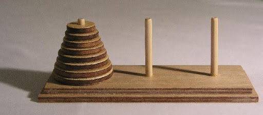
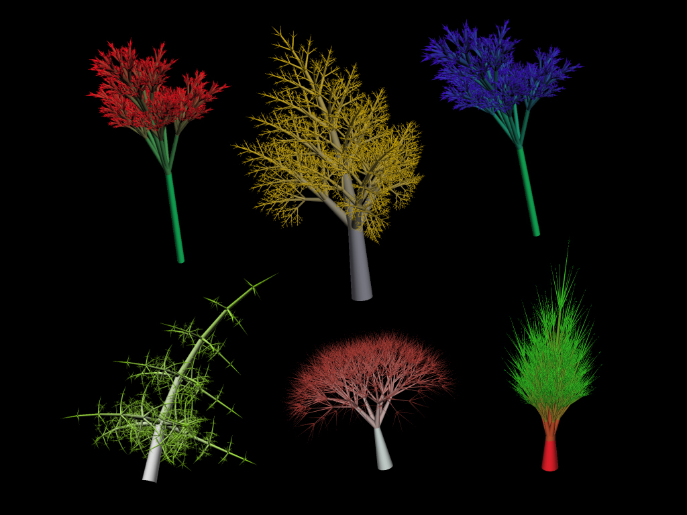

# Recursive Functions and Algorithm Analysis

## Recursion

### Towers of Hanoi

We want to move a pile of discs of different size from one pole to another, with the condition that no larger disc can sit on top of a smaller disc!




#### A Python solution to this problem
```python
'''
Source code from
http://interactivepython.org/runestone
/static/pythonds/Recursion/TowerofHanoi.html

used for classroom demonstration.
'''
def move_tower(height,from_pole, to_pole, with_pole):
    if height >= 1:
        move_tower(height-1,from_pole,with_pole,to_pole)
        move_disk(from_pole,to_pole)
        move_tower(height-1,with_pole,to_pole,from_pole)

def move_disk(fp,tp):
    print("moving disk from",fp,"to",tp)

move_tower(3,"A","B","C")
#move_tower(15,"A","B","C")
```


### Factorial

```python
def factorial( n ):
  ''' Compute factorial of n recursively.
  Input: n is a non-negative inteter
  '''
  if n == 0:
    return 1
  else:
    return n * factorial( n - 1 )

print('Factorial 10 is : ' + str(factorial(10)))
print('Factorial 5 is : ' + str(factorial(5)))
```

These types of problems lead to a category of solution called recursion!

_While some examples of recursion may be more complicated than the level of CSCI 203, we will learn the basic strategy in this class. Recursion will be studied in more depth in other CS courses._

## Recursion
Two important features of a recursive solution:
- A recursive solution must have one or more base cases (when to stop)
E.g. `factorial(0) == 1`
- A recursive solution can be expressed in the exact same solution with a smaller problem size E.g., `factorial(n) = n * factorial(n-1)`

```python
def factorial( n ):
  if n == 0:
    return 1   # base case
  else:
    return n * factorial( n - 1 ) # recursion with smaller problem
```

```python
def move_tower(height,from_pole, to_pole, with_pole):
  if height >= 1:
    move_tower(height-1,from_pole,with_pole,to_pole) # recursion with smaller problem
    move_disk(from_pole,to_pole)
    move_tower(height-1,with_pole,to_pole,from_pole) # recursion with smaller problem

  # implicit base case when height < 1
```

#### Recursion in Nature
The key:  self-similarity


### Activity
Write a function called `my_len` that computes the length of a string recusively.
- What is the base case?
- What is the recursive call?

### Activity 2
Complete the following recursive function:
```python
def sum_of_digits(s):
  """ input: a string of numbers -‘252674’
      output: the sum of the numbers 26
  """
  if  # TODO:
    # TODO
  else:
    # TODO
```

## Analysizing Recursive Functions
Try to anaylize the time complexity of the `factorial` and `hanoi` problems.
- What pattern can you observe when deterimining time complexity of recursive functions?
- Are recursive functions legible for large problem sizes (n)?
