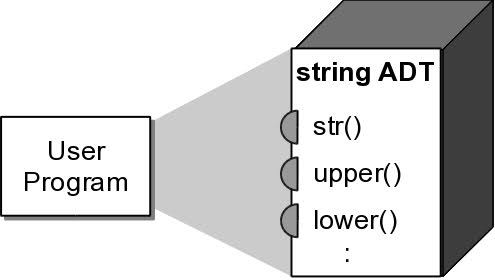
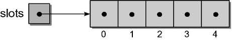
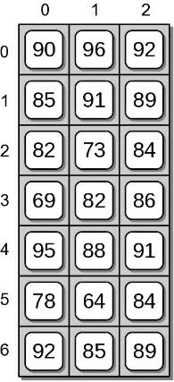
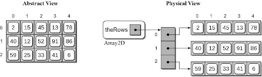

# ADTs and Arrays

## Abstract Data Types

An abstract data type (ADT) is a collection of data and a set of operations on the data.

An ADT has the following features:
- **Information Hiding**: It hides implementation details from the users. That is, it presents what the ADT does, not how it does.
- It provides an **interface** that other programs can use to access the functionality of the ADT.

ADTs can be viewed as black boxes
- functionality is provided through an interface.
- implementation details are hidden inside the box.



### Types of operations
- **constructors** – creates the ADT
- **accessors** – gets information
- **mutators** – changes information
- **iterators** – navigates through it

### Defining Operations
The ADT definition should specify:
- required inputs and resulting outputs.
- state of the ADT instance before and after the operation is performed.

#### Preconditions
Condition or state of the ADT instance and data inputs before the operation is performed.
- Assumed to be true.
- Error occurs if the condition is not satisfied.
    - ex: index out of range
- Implied conditions
    - the ADT instance has been created and initialized
    - valid input types

#### Postconditions
Result or state of the ADT instance after the operation is performed.
  - Will be true if the preconditions are met.
    - given: `x.pop(i)`
    - the ith item will be removed if `i` is a valid index.

The specific postcondition depends on the type of operation:
  - Access methods and iterators
    - no postcondition because the state of the object is not changed.
  - Constructors
    - create and initialize ADT instances.
  - Mutators
    - the ADT instance is modified in a specific way.

#### Exceptions
OOP languages raise exceptions when errors occur.
An event that can be triggered by the program.
Optionally handled during execution. Example:


```python
myList = [12, 50, 5, 17]
print(myList[4])

# IndexError: list index out of range
```

#### Evaluating a Data Structure
Evaluate the data structure based on certain criteria.
Does the data structure:
  - provide for the storage requirements of the ADT?
  - provide the necessary functionality to fully implement the ADT?
  - lend itself to an efficient implementation of the operations?

#### Selecting a data structure
Multiple data structures may be suitable for a given ADT.
  - Select the best possible based on the context in which the ADT will be used.
  - Common for language libraries to provide multiple implementations of a single ADT.

#### Assertions

Used to state what we assume to be true.
```python
assert value != 0, "Value cannot be zero."
```
If condition is false, a special exception is automatically raised.
- Combines condition testing and raising an exception.
- Exception can be caught or let the program abort.

## Arrays
Arrays are similar to lists but different in implementation. Differences to lists:

- Arrays need to be declared. Lists don't, since they are built into Python. Because of this, lists are used more often than arrays.
- Arrays can store data very compactly and are more efficient for storing large amounts of data.
- Arrays are great for numerical operations; lists cannot directly handle math operations.

Both python lists and arrays share some similarities:
- elements are ordered
- we can iterate and index them
- we can access items in constant time (arrays) or almost constant time (lists)

Arrays and Lists have to be created and initialized before they can be used:
```python
# List example
slots = [None for i in range(5)]

for i in range(len(slots)):
  print(slots[i])
```

elements are like any other variable.

We must keep track of the size of the array



## 2-D Arrays
Arrays of 2 or more dimensions are not supported at the hardware level.
- Most languages provide some mechanism for creating and managing multi-dimensional arrays.
- 2-D arrays are very common data structure in computer science.

A 2-D array consists of a collection of elements organized into rows and columns.
```
Array2D( nrows, ncols )
  num_rows()
  num_cols()
  clear( value )
  getitem( i1, i2 )
  setitem( i1, i2, value )
```

### Activity
Suppose we have a text file `data.txt` containing exam grades for multiple students.
- Extract the grades from the file.
- Store them in a 2-D array.
- Compute the average exam grades.
- Example: n (7) students with m (3) grades each

```
7
3
90   96   92
85   91   89
82   73   84
69   82   86
95   88   91
78   64   84
92   85   89
```

#### How to tackle the problem?

##### Open the data file
```python
grade_file = open( filename, "r" )
```

##### Create a 2-D array
```python
exam_grades = Array2D( num_students, num_exams )
```
Don't forget to import your array module first.

##### Read the grades into the array
```python
i = 0
for student in grade_file :
  grades = student.split()
  for j in range( num_exams ):
    exam_grades[i,j] = int( grades[j] )
  i += 1
```

The contents of the 2-D array produced by the previous code segment:



#### Step 2: How to compute the average for the class?

```python
# Compute each student's average exam grade.

for i in range( num_students ) :

  total = 0
  for j in range( num_exams ) :
    total += exam_grades[i,j]

  exam_avg = total / num_exams
  print( f"{i+1:2}: {exam_avg:>6.2f}")
```

### Array of Arrays Implementation


```python
class Array2D :
  def __init__( self, n_rows, n_cols ):
    self._the_rows = Array( numRows )
    for i in range( n_rows ) :
      self._the_rows[i] = Array( n_cols )

  def num_rows( self ):
    return len( self._the_rows )

  def num_cols( self ):
    return len( self._the_rows[0] )

  def clear( self, value = 0):
    for row in range( self.num_rows() ):
      row.clear( value )
```

Subscript notation:
```
y = x[r, c]  x[r, c] = z
```
Subscripts are passed to the methods as a tuple.
The size of the tuple must be verified.

```python
class Array2D :
# ...
  def __getitem__( self, ndx_tuple ):
    assert len(ndx_tuple) == 2, "Invalid number of array subscripts."
    row = ndx_tuple[0]
    col = ndx_tuple[1]
    assert row >= 0 and row < self.num_rows() \
       and col >= 0 and col < self.num_cols(), \
           "Array subscript out of range."
    the_row_array = self._the_rows[row]
    return the_row_array[col]
```

```python
  def __setitem__( self, ndx_tuple, value ):
    assert len(ndx_tuple) == 2, "Invalid number of array subscripts."
    row = ndx_tuple[0]
    col = ndx_tuple[1]
    assert row >= 0 and row < self.num_rows() \
       and col >= 0 and col < self.num_cols(), \
           "Array subscript out of range."
    the_row_array = self._the_rows[row]
    the_row_array[col] = value

```
