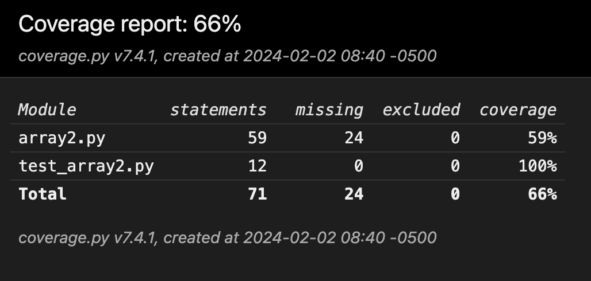
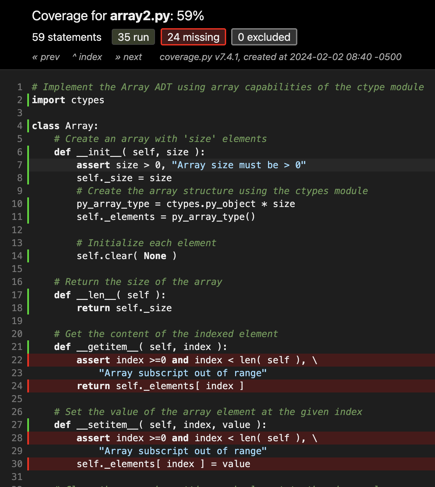

# Lecture 3.3 2D Array Activities

In this lecture we will go through a series of practical problems and improve the given Array / 2D array classes in the process.

I have made a copy of `array.py` in `array2.py`. Lets work in this new file today.

## More on testing

Lets warm up by checking out and running the unittests provided in `test_array2.py`. Use the terminal and test discovery to find and automatically run all unittests in the `week_3` folder.

#### Test-Driven Development
There is a coding philosophy trending that is becoming more and more popular: test-driven development.

_The basic idea is to start writing your tests before you actually start writing your program code. It completly changes how we approach problem solving._

### Test Coverage
In professional environments we use tools that help us discover untested parts of our program. In python one such tool is called [coverage.py](https://coverage.readthedocs.io/en/7.4.1/).


#### Installation
You can install it via:
```bash
python3 -m pip install coverage
```

When you do you might get the following warning:
```
WARNING: The scripts pip, pip3 and pip3.11 are installed in '/Users/af033/Library/Python/3.11/bin' which is not on PATH.
  Consider adding this directory to PATH or, if you prefer to suppress this warning, use --no-warn-script-location.
```

If you got this warning you will need to add python first to your binary path so the coverage command can work.

On Mac you will need to add the follwing line to your `~/.zshrc` file:
```
export PATH=~/Library/Python/3.11/bin:$PATH
```
On Windows you could follow [this guide](https://helpdeskgeek.com/windows-10/add-windows-path-environment-variable/) or reinstall python with the option "forward paths" enabled.

#### Usage
Now instead of using
```
python -m unittest
```
you can now use
```
coverage run -m unittest discover
```

This does track how often each line in your program was excecuted while running your tests. **Good testing aims for 100% test coverage.**

Its possible to see the summary of the report in the terminal:
```
coverage report
```

Or you could generate a html page with all the details:
```
coverage html
```

#### Activity
Try that out now.
- What is the test coverage of `array2.py`?
- Which functions remain untested according to coverage?

You should be getting output like this:


Upon clicking on any file you can see the code and the missed lines in detail:



#### Homework / Activity
We will now expand on providing more functionality to the Array and Array2D classes.

However once this lecture is over, I highly encourage you to practice good testing with a singular goal in mind:
- reach 100% test coverage in  `array2.py`

**Keep in mind:** 100% test coverage is not a guarantee that your code is free of errors. Its however ensuring that you have gone through all branches and functions and thus reduce the possibility of something going wrong to a minimum.


## More Array Functionality
What prints when you run this code?
```python
from array2 import Array

obj = Array(2)
print(obj)
```
We are getting something like this:
```
<array2.Array object at 0x104773cd0>
```

Lets warm up by changing this output to something more informative:
```
Array(2) [None, None]
```

#### Activity
Grab a partner and add the necessary function to make this work.
