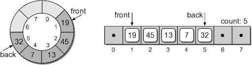

## Homework Review

Double check if your output (when running your `flight_finder.py`) matches what the instruction told you it should match:

```
Origin           │ Destination      │ Route
─────────────────┼──────────────────┼──────────────────────────────
Albuquerque      │ San Diego        │ Albuquerque > Chicago > San Diego
Boston           │ Chicago          │ Boston > Chicago
Albuquerque      │ Paris            │ -
San Diego        │ Chicago          │ -
```

### Formatted Strings

To format strings in Python you should use `f-strings`:
```python
name = "Sam Adams"
age = 19

print(f"{name:<10} | {age:>2}")
print(f"{'George':<10} | {5:>2}")
```

The code above will produce the following output:
```
Sam Adams  | 19
George     |  5
```

We can also center content and automatically round numbers to a certain decimal:
```python
f"{3.1415:^10.2f}"
# '   3.14   '
```

The general syntax is:
- put a `f` before a string `""`
- use `{` and `}` inside a string to indicate the position of a placeholder
- use values or variables before the `:`
- follow with a `<`, `>`, `^` and a number `n` to left, right-, or center-align the value into `n` spaces
- (optional) for decimals: use `.xf` after your alignment instructions to indicate the result should be a float rounded to `x` decimals.
- If you ever wanted to use `{` or `}` normally inside a formatted string you can do so by escaping them:

```python
f"Hello \{World\}"
# Hello {World}
```

## Stack Time complexity
| Operation | [Python List](https://www.geeksforgeeks.org/complexity-cheat-sheet-for-python-operations/) | Array |
| --------- | --------------- | ----- |
| len()     | O(1)            | O(1)  |
| push()    | O(1)            | ???   |
| pop(0)    | _O(n)_          | ???   |
| peek()    | O(1)            | O(1)  |

# Queues

A restricted access container that stores a linear collection.

- Very common for solving problems in computer science that require data to be processed in the order in which it was received.
- Provides a **first-in first-out** (FIFO) protocol.

New items are added at the back while existing items are removed from the front of the queue:


## The Queue ADT
A queue stores a linear collection of items with access limited to a first-in first-out order.
- New items are added to the back.
- Existing items are removed from the front.

```
Queue()
is_empty()
len()
enqueue( item )
dequeue()
```

### Queue: Circular Array
circular array – an array viewed as a circle instead of a line.


- Items can be added/removed without having to shift the remaining items in the process
- Introduces the concept of a maximum-capacity queue that can become full

How should the data be organized within the array?
- **count** field – number of items in the queue.
- **front** and **back** markers – indicate the array elements containing the queue items.


To enqueue an item:
- new item is inserted at the position following back
- back is advanced by one position
- count is incremented by one.

Suppose we enqueue `32`:


To dequeue an item:
- the value in the front position is saved
- front is advanced by one position.
- count is decremented by one.

Suppose we dequeue an item:



Suppose we enqueue items `8` and `23`:


What happens if we enqueue `39`?
- Since we are using a circular array, the same steps are followed.
- But since back is at the end of the array, it wraps around to the front.


### Array Based Circular Queue Implementation
```python
class Queue :
  def __init__( self, max_size ) :
    self._count = 0
    self._front = 0
    self._back = max_size - 1
    self._qarray = Array( max_size )

  def is_empty( self ) :
    return self._count == 0

   # A new operation specifically for the circular array.
  def is_full( self ) :
    return self._count == len(self._qarray)

  def __len__( self ) :
    return self._count

  def enqueue( self, item ):
    assert not self.is_full(), "Cannot enqueue to a full queue."
    max_size = len(self._qarray)
    self._back = (self._back + 1) % max_size
    self._qarray[self._back] = item
    self._count += 1

  def dequeue( self ):
    assert not self.is_empty(), "Cannot dequeue from an empty queue."
    item = self._qarray[ self._front ]
    max_size = len(self._qarray)
    self._front = (self._front + 1) % max_size
    self._count -= 1
    return item
```

## Queue Time complexity
| Operation         | Array |
| ---------         | --------------- |
| `Queue()`         | O(1)            |
| `len(q)`          | O(1)            |
| `q.is_empty()`    | O(1)            |
| `q.is_full()`     | O(1)            |
| `q.enqueue(x)`    | O(1)            |
| `x = q.dequeue()` | O(1)            |

## Activity
The circular queue we just implemented uses a count to control how the queue operates. **Your exercise is to implement the same circular queue without the count variable.**
- The basic idea is to use the relation between front and back to manage the queue.
- Note that without a count, one can’t tell the difference between a full queue or empty queue if front == back, so the two have to be different when queue is empty or full.
