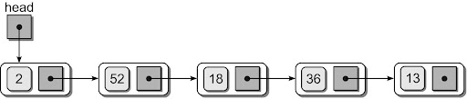
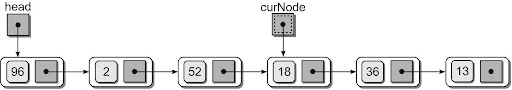
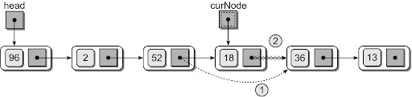
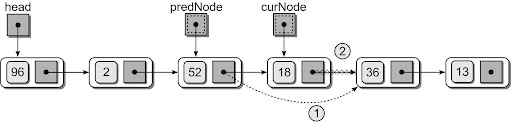
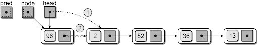

## Useful Git Commands

#### Setting up public key authentication (unix system)
```bash
cd ~
ssh-keygen
```
Hit `Enter` three times when asked stuff.

Then go to [https://gitlab.bucknell.edu](https://gitlab.bucknell.edu). Login and go to Preferences -> SSH Keys

Add your public key as a new key. You can find your public key using the following command:
```bash
cat ~/.ssh/id_rsa.pub
```

This is a one time thing and allows you to use gitlab without ever entering your password again.

#### Setup/copy a repository for the first time
```bash
git clone <link_to_git.git>
```

#### Upload To Repository
```bash
git add . && git commit -m "<msg>"
git push
```
Carefull. Do not change the same files at the same time! --> Git Conflict. This is going to be a disaster to resolve.


#### Download from Repository
```bash
git pull
```

#### Collaboration using Git

To collaborate on a project one team member should create a repository in Gitlab and invite the other team members as `Maintainers`.

You can then all clone the repository, push and pull to it.

# Singly Linked Lists

Given a sorted list of numbers, insert a new number into this sorted list:
```
[3, 5, 7, 10, 12, 20]
```
insert `6` into this list:
```
[3, 5, 6, 7, 10, 12, 20]
```
How do you accomplish this seemingly simply task without library functions?
**Take 3 minutes to work it out.** Consider what may happen with your solution.

### Possible Solution

```python
def insert_sorted(k, my_list):
    """ Insert k into a sorted list my_list"""
    new_list = [x for x in my_list] + [k]  # have k to occupy a spot!
    i = find_pos(k, my_list)
    for j in range(len(new_list)-1, i-1, -1):  # shift each element right
        new_list[j] = new_list[j-1]
    # now put k where it belongs to
    new_list[j] = k

    return new_list

def find_pos(k, my_list):
    """ Find where k should be in the sorted list my_list"""
    i = 0
    while i < len(my_list) and k > my_list[i]:
        i += 1
    return i    # i could be len(my_list)!
```
T(n) = `4 * n` steps!! Can we do better? How?

#### One issue at a time:
- `new_list = [x for x in my_list] + [k]`

  We need to increase the capacity of the list to hold the new element. Weather the list is implemented as a Python list or an array, this would take `n` steps.

- `i = find_pos(k, my_list)`

  We need to find the right spot for the new number, which takes `n` steps.

- `for j in range(len(new_list)-1, i-1, -1):`

  Shifting elements to the right takes `2 * n` steps

_Using a linked list we can make two of the three operations in constant time!_

## Linked Structure

- Constructed using a collection of objects called `nodes`.
- Each node contains data and at least one reference or `link` to another node.
- `Linked list` – a linked structure in which the nodes are linked together in linear order.



## Python Implementation

The nodes are constructed from a simple storage class:
```python
class ListNode:
  def __init__( self, data ):
    self.data = data
    self.next = None
````

List contains two nodes, a `head` and a `tail`:
```python
class UserList:
  def __init__( self ):
    self.head = None
    self.tail = None
```

How to build a list?
```python
my_list = UserList()  # initial list head == None
a_node = ListNode(12) # create a node
my_list.insert_after(node)  # insert the node to list
my_list.insert_after(ListNode(3)) # another node
```

The insert_after() could look like:
```python
def insert_after(self, node):
    """ Insert a node with data at the end of the list
    """
    if self.is_empty():   # the node will be the first one in list
        self.head = node
        self.tail = node
    else:                 # insert after the current tail
        self.tail.next = node
        self.tail = node
```

### Activity
Write the function `insert_before()` that inserts the node before the head.

## Removing Nodes
An item can be removed from a linked list by removing or unlinking the node containing the item.

1. Find the node containing the item:



2. Unlink it:



Removing a node from the middle of the list requires a second external reference:



Result:


#### Removing the first node is a special case.

The head reference must be reposition to reference the next node in the list:




## Activity: Linked List Queue

Using what you have learned today about linked lists and removing nodes,
can you sketch out/draft a solution for a linked list queue that can enqueue and dequeue in both constant time?

_Do we need a head and a tail pointer? Do we add new nodes at the front or the back of the list? What end do we remove them from?_

