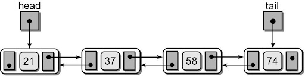
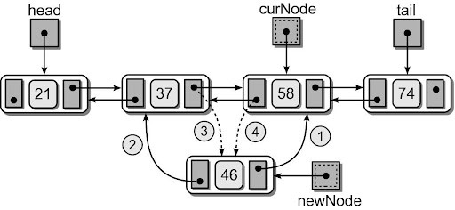
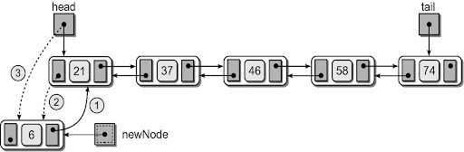
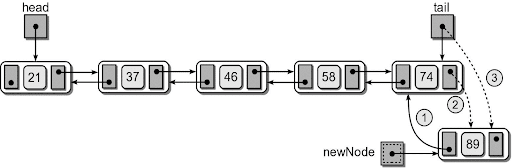

# Doubly Linked Lists

A  linked list in which each node contains a data component(s) and two links:
- one pointing the next node and
- one pointing to the preceding node.



### In Python's terms...
The node storage class is similar to that of a singly linked list.

```python
class DNode :
  def __init__( self, data ):
    self.data = data
    self.next = None
    self.prev = None
```

### Insert

#### 1. Insert in the middle before a given node.


#### 2. Insert at the front before the **head**.


#### 3. Insert at the end after the **tail**.


## Activity
- Implement `insert_before()`
- Implement `insert_after()`
- Implement `insert_sorted()`
- Implement `__str__()`
- Implement `remove()`
- Implement `clear()`

Make sure all unittests in `test_dlist.py` run correctly!
