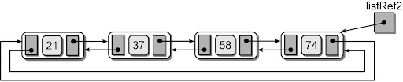

# Circular Linked Lists

Another variation of the linked list in which the nodes form a continuous circle.
- Allows for a complete traversal from any initial node.
- Used with round-robin type applications.
- The external reference can point to any node in the list. Common to reference “end” of the list.


A circular linked list can also be doubly linked.



For now, we will concentrate on singly linked circular lists.

```python
class Node:
  """The node class for list nodes"""
  def __init__(self, data):
    self.data = data
    self.next = None
```

```python
class CircularListSingly:
  def __init__(self):
    # self.ref always points to the end of the list
    # alternatively we could have it point to the first
    self.ref = None
```

### Traversal
```python
def __str__(self):
    """ String function """
    h = self.ref
    if h == None:
        return 'CList[]'
    s = 'CList[' + str(h.data)
    h = h.next
    while h != self.ref:

        s += ', '
        s += str(h.data)
        h = h.next

    s += ']'
    return s
```

### Inserting Nodes
We can look at two different types of circular lists
- Unsorted
- Sorted

#### Unsorted Circular Linked Lists: Inserting
One needs to consider two cases (identical to other lists insertion) :
- Insert a new node into an empty list
- Insert a new node into a non-empty list

```python
def insert(self, node):
  """Insert a node with value"""
  if self.ref == None: # empty list
    self.ref = node
    node.next = self.ref
  else: # insert after ref
    node.next = self.ref.next
    self.ref.next = node
```

#### Sorted Circular Linked Lists: Inserting (three cases)
1. Insert into an empty list:
```python
if self.ref is None:
  self.ref = new_node
```


2. Insert at the "front" (one node past listRef)
```python
elif new_node.data > self.ref.data: # insert in front, past ref
  new_node.next = self.ref.next
  self.ref.next = new_node
  self.ref = new_node
```


3. Insert in the middle.
```python
else: # new_node.data < self.ref.data, need to locate the position
  prev, place = self.find_place(new_node)
  new_node.next = place
  prev.next = new_node
```


`find_place()` How to find the right place to insert?
```python
def find_place(self, node):
  prev = self.ref
  cur - self.ref.next
  while cur != self.ref and cur.data < node.data:
    prev = cur
    cur = cur.next
  return prev, cur
```

## In-Class Activity
Try out `test_singly_circular_list.py`.

Then (in small groups) complete the `remove(self, value±±)` method.

## Homework (4 points)

_The following homework was handed out on paper in class. Please bring your hand-written submission back on Friday to class._

1. Given the doubly linked list and its linked node definition below, implement the sorted insertion method.

```python
class DListNode:
  def __init__(self, data):
    self.data = data
    self.next = self.prev = None

class DLinkedList:
  def __init__(self):
    self.head = self.tail = None

  def insert_sorted(self, node):
    """Insert the node with data into the list,
    keep the ascending order"""
```

2. Given the doubly linked circular list and its linked node definition below, implement the insertion method that inserts the new node to the right of the reference.
```python
class DListNode:
  def __init__(self, data):
    self.data = data
    self.next = self.prev = None

class CircularList:
  def __init__(self):
    self.ref = None

  def insert(self, node):
    """ Insert the node to the right of the list """
```
