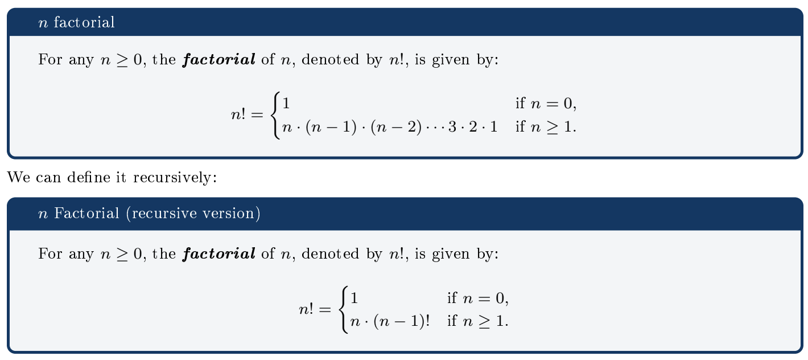

# Recursion

**Acknowledgement:** Thanks to Prof. Lee for today's examples.

### Recursion Review: Factorial

```python
# Iterative Appraoch
def fact(n):
  ans = 1
  if n > 1:
    for i in range(1, n+1):
      ans *= i
  return ans
```
```python
# Recursive Appraoch
def fact(n):
  # base case
  if n == 0: return 1
  # recursive cases
  return n * fact(n - 1)
```
- A recursion is a function that calls itself (recursive case)
- A recursion must have at least one terminal condition (base case)
- Every iteration can be written as a recursion (vice versa)

### Recursion vs Iteration
When/why do we prefer recursion to iteration?
  1. Dividing a problem into smaller but similar problems
      - Very often, a divide-and-conquer approach
  2. Shorter codes and cleaner logic for some data structures
  3. Some logic is naturally recursive (e.g. the Factorial, Fibonacci numbers, etc.)

## Example: Printing Filenames

Print all filenames under a folder and its subfolders:

### Iteration
We store all file/folder we need to check in a set/list/queue, and iterating it until it is empty.

```python
from os import path, listdir

def print_files(in_path):
  # create a set of paths to check
  paths = {in_path}

  while len(paths):
    cur_path = paths.pop()
    if path.isdir(cur_path):
      for item in listdir(cur_path):
        paths.add(path.join(in_path, item))
    else:
      print(cur_path)
```

### Recursion
We recursively check the sub-folder.

```python
from os import path, listdir

def print_files(in_path):
  if path.isdir(in_path):
    # recursive cases
    for item in listdir(in_path):
      print_files(path.join(in_path, item))
  else:
    # base case
    print(in_path)
```

What are repeating here? Print the file, and go into the sub-folders. What keeps changing is always the
parameter(s) passing to the recursive function!

## Example: Reverse print a circular list
Write a method to print each item stored in a circular linked list in the reverse
order.

We are repeating: go to the next node and print the current node. What keeps changing: the current node.

### Iterative Approach
Idea: we iterate until we reach back the current selected node.

```python
def reverse_print(self):
  curr = self.head
  result = ""

  while curr and curr.next is not self.head:
    result = result + " " + curr.data
    curr = curr.next

  print(result.lstrip())
```

### Recursive Approach (Activity)
Idea: we recursively call itself until reaching back the current selected node.

```python
def reverse_print(self):
  # TODO
  pass
```

## Example: Permutations of Strings

Given a string, write a function to print all its permutation. e.g., given `123`, it should print `123`, `132`,
`213`, `231`, `312`, and `321`.

Repeat: Select one char from the remaining string. Changing: the input string and the result.

### Iterative Approach
Idea: we iteratively select the permutation set until we have nothing to permute.

```python
def permuatation(in_s):
  results = [("", in_s)]
  while len(results):
    cur_r, cur_s = results.pop()
    if(len(cur_s)):
      for i in range(len(cur_s)):
        r = cur_s[i]
        p = cur_s[0:i] + cur_s[i+1:]
        results.append((cur_r + r, p))
    else:
      print(cur_r)
```

### Recursive Approach (Activity)
Idea: we recursively call itself to permute the remaining parts.

```python
def permuatation(in_s, result=""):
  # TODO
  pass
```

## Example: Root Finding

Given a function `f(x)`, and a solution `xˆ` such that `f(ˆx)` = 0 within an error
tolerance `ε` (i.e. `|f(ˆx)| < ε)`.

### Idea
1. Pick two random values `n` and `p` such that
`f(n) < 0` and `f(p) > 0`.
2. Compute a new value `m = (n+p) / 2`

3. Compare `|f(m)|` and `ε`:
  - (Base case) if |f(m)| < ε, we nd a
solution, return m.
  - (Recursive cases) else
    - if `f(m) < 0` set `n = m`
    - else if `f(m) > 0` set `p = m`
    - repeat step 2-3.

### Iterative Approach
```python
from random import uniform
from math import log
def f(x):
  return log(x)

def root_finding(f, n, p, e = 1e-8):
  while f(n) > 0: n = uniform(0.1, 2)
  while f(p) < 0: p = uniform(0.1, 2)

  m = (n + p) * 0.5

  while abs(f(m)) >= e:
    if f(m) < 0: n = m
    elif f(m) > 0: p = m
    m = (n + p) * 0.5

  return m
```

### Recursive Approach (Activity)
```python
def root_finding(f, n, p, e=1e-8):
  # TODO
  pass
```
